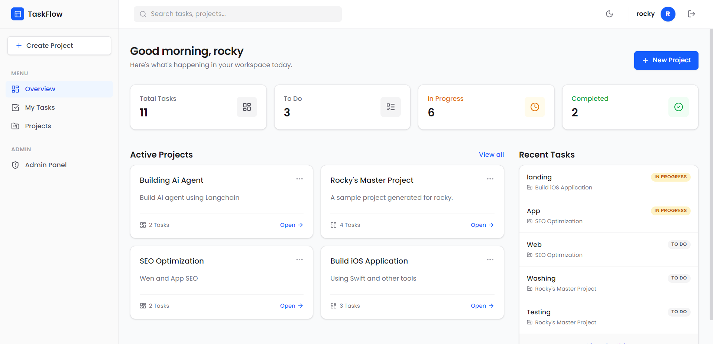
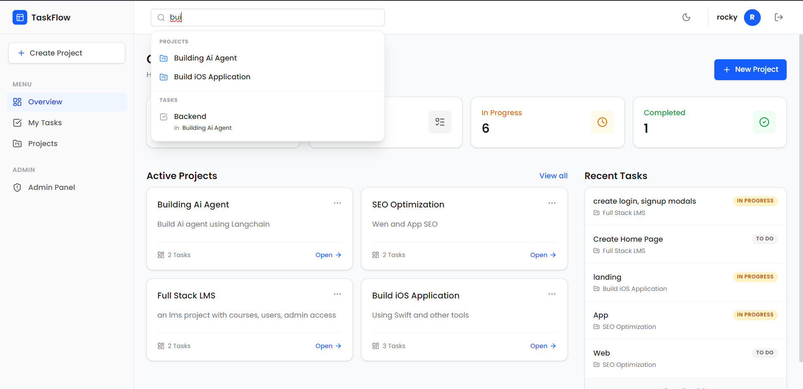
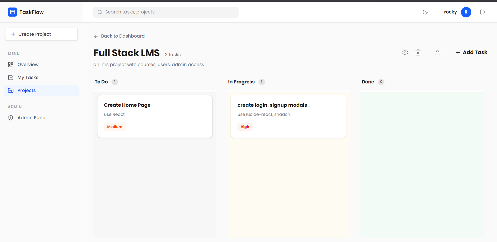

# Task Management Web Application

## 📖 Overview

In today's fast-paced work environment, managing tasks, deadlines, and team collaboration can quickly become overwhelming. This Task Management Web Application is designed to solve this by providing a unified, intuitive workspace that bridges the gap between individual productivity and team coordination.

Unlike traditional, cluttered project management tools, this application focuses on an uncompromised user experience. It combines a highly responsive, modern interface with a powerful Kanban-style board to visualize workflows at a glance. Whether you are an independent freelancer organizing daily tasks or a team lead coordinating multiple projects, this platform adapts to your workflow.

The application is built on a robust, decoupled architecture. The backend is powered by FastAPI, ensuring high performance, strict type validation, and rapid data processing, while the frontend leverages React and Tailwind CSS to deliver a seamless, native-feeling single-page application. With secure JWT-based authentication and state management, users can confidently manage their data, invite collaborators, and track progress without friction.

## 🚀 Key Features

- **User Authentication**: Secure Registration & Login using JSON Web Tokens (JWT).
- **Dashboard Overview**: Centralized view for managing Personal and Shared Projects.
- **Advanced Search**: Quickly search across your projects and tasks.
- **Kanban Board**: Seamless drag-and-drop functionality to move tasks between stages (To Do, In Progress, Done).
- **Task Management**: Assign task priorities, set due dates, and assign team members.
- **Collaboration**: Invite other users to your projects via email for team collaboration.
- **Theming**: Fully responsive UI built with Tailwind CSS (v4) with native Dark Mode support.

## 🛠 Tech Stack

**Frontend:**

- React.js (v19)
- Vite
- Tailwind CSS (v4)
- React Router DOM
- @hello-pangea/dnd (Drag and Drop)
- Lucide React (Icons)
- Axios

**Backend:**

- Python 3.9+
- FastAPI
- SQLAlchemy (ORM)
- SQLite (Database)
- Passlib & Jose (JWT Auth and Password Hashing)

## � Project Structure

### Backend Structure

```
backend/
├── main.py              # FastAPI application entry point and route setup
├── database.py          # Database connection and session management
├── models.py            # SQLAlchemy ORM models for database tables
├── schemas.py           # Pydantic schemas for request/response validation
├── requirements.txt     # Python dependencies
├── vercel.json          # Deployment configuration for Vercel
├── admin_seed.py        # Admin user seed data setup
├── seed_data.py         # Initial database seed data
├── view_db.py           # Database inspection and debugging utility
│
├── routers/             # FastAPI route handlers organized by domain
│   ├── auth.py         # Authentication endpoints (login, register, token refresh)
│   ├── admin.py        # Admin-specific endpoints and operations
│   ├── projects.py     # Project CRUD operations and project-related endpoints
│   └── tasks.py        # Task management endpoints and task operations
│
└── utils/              # Utility functions and helpers
    └── auth.py         # Authentication helpers (JWT validation, password hashing)
```

### Frontend Structure

```
frontend/
├── index.html           # HTML entry point
├── package.json         # Node.js dependencies and project metadata
├── vite.config.js       # Vite build configuration
├── eslint.config.js     # ESLint code quality rules
├── vercel.json          # Deployment configuration for Vercel
├── README.md            # Frontend-specific documentation
│
├── public/              # Static assets served directly
│
└── src/                 # React source code
    ├── main.jsx        # React application initialization
    ├── App.jsx         # Root component routing and layout
    ├── App.css         # Global application styles
    ├── index.css       # Base CSS reset and utilities
    │
    ├── api/            # API communication layer
    │   └── client.js   # Axios configuration and API request functions
    │
    ├── assets/         # Images, videos, and media files
    │
    ├── context/        # React Context for global state management
    │   └── AuthContext.jsx # Authentication state and user session context
    │
    ├── components/     # Reusable React components
    │   ├── Button.jsx       # Reusable button component with variants
    │   ├── Input.jsx        # Reusable input field component
    │   ├── Modal.jsx        # Modal dialog component for popups
    │   ├── Navbar.jsx       # Top navigation bar component
    │   ├── Sidebar.jsx      # Side navigation menu component
    │   └── TaskListView.jsx # Task list display component
    │
    └── pages/          # Full page components (routes)
        ├── Landing.jsx      # Landing/home page for unauthenticated users
        ├── Login.jsx        # User login page
        ├── Register.jsx     # User registration page
        ├── Dashboard.jsx    # Main dashboard showing projects and overview
        ├── ProjectsList.jsx # List of all user projects
        ├── ProjectView.jsx  # Individual project view with Kanban board
        ├── Tasks.jsx        # Task management view
        └── AdminDashboard.jsx # Admin-specific dashboard and controls
```

## �📸 Application Screenshots

### 1. Dashboard

The main command center where you can view all your ongoing projects and quick stats.


### 2. Search Functionality

Easily locate projects or specific tasks across your workspace using the integrated search feature.


### 3. Project Kanban Board

Organize your tasks efficiently using our intuitive drag-and-drop Kanban interface.


## ⚙️ Architecture Highlights

- **Database Structure**: Relational database architecture using SQLAlchemy ORM (sqlite:`taskapp.db`). Includes robust modeling for `users`, `projects`, `project_members`, and `tasks`.
- **API & Security**: Fully protected API routes requiring Bearer tokens in the Authorization header.
- **State Management**: Context API (`AuthContext`) manages global application state for users.

---

_For detailed local setup instructions, please refer to the [SETUP.md](./SETUP.md) file._
